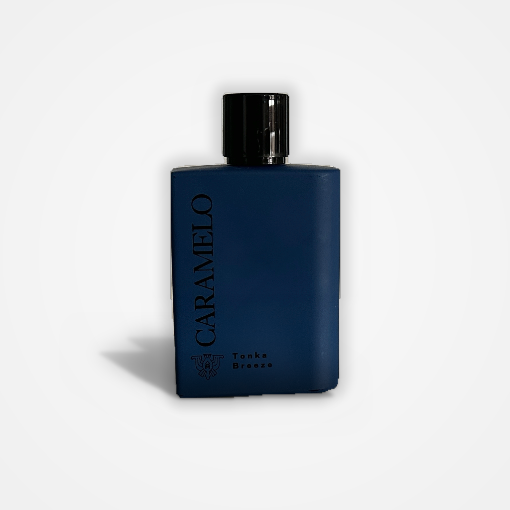

# Photify — e-commerce image generator

Photify recorta el producto de una foto y lo coloca sobre un fondo nuevo, todo en local y sin pasar por ninguna API de pago. Subes la imagen, marcas el objeto (o dejas que lo detecte solo), y obtienes un PNG con fondo transparente que luego puedes montar sobre un fondo de estudio o sobre una escena del catálogo.

La parte pesada —segmentación con FastSAM y composición— corre en el backend. El frontend es una SPA en React que dibuja el bounding box y enseña el resultado.



## Cómo funciona

1. Subes una foto del producto.
2. Dibujas una caja alrededor del objeto, o usas la detección automática (Canny).
3. El backend pasa FastSAM por la imagen y devuelve el recorte RGBA.
4. Opcionalmente compones ese recorte sobre un fondo de estudio procedural o una escena del catálogo, con sombras, armonización de color y reflejos según el fondo.

Nada sale de tu máquina: no hay claves de API ni servicios externos de por medio.

## Stack

**Backend** — Python 3.10+, FastAPI + Uvicorn, ultralytics (FastSAM), Pillow, OpenCV y NumPy.

**Frontend** — React 19, Vite 7, Tailwind 4 y react-router-dom v7.

## Puesta en marcha

Necesitas Python 3.10+, Node.js 18+ y los pesos del modelo en `backend/app/models/FastSAM-s.pt`. Los pesos no están versionados; se descargan de los [releases de Ultralytics](https://github.com/ultralytics/assets/releases). Sin ellos el backend no arranca.

### Backend

Desde la raíz del proyecto:

```powershell
python -m venv venv
.\venv\Scripts\activate          # en Linux/macOS: source venv/bin/activate
pip install -r requirements.txt

cd backend\app
uvicorn main:app --reload
```

El servidor arranca en `http://localhost:8000`. Tiene que lanzarse **desde `backend/app`**: los imports son planos (`from segmentation import ...`), no paquetes con prefijo. Al arrancar precarga FastSAM en memoria y escanea el catálogo de fondos.

### Frontend

```powershell
cd frontend
npm install
npm run dev        # http://localhost:5173
```

CORS está abierto, así que los dos servidores de desarrollo conviven sin necesidad de proxy.

## API

| Método | Ruta | Para qué |
|---|---|---|
| `GET` | `/` | Health check |
| `POST` | `/segment_bbox/` | Segmentación con bounding box manual |
| `POST` | `/segment_auto/` | Segmentación automática (Canny → FastSAM) |
| `POST` | `/compose/studio/` | Composición sobre fondo de estudio procedural |
| `POST` | `/compose/scene/` | Composición sobre un fondo del catálogo |
| `GET` | `/backgrounds/` | Lista el catálogo de fondos por categoría |
| `POST` | `/backgrounds/rescan/` | Re-escanea la carpeta de fondos en caliente |
| `GET` | `/backgrounds/full\|thumb/{category}/{name}` | Sirve un fondo a resolución completa o su miniatura |

Las coordenadas de bbox y de posición viajan como **JSON dentro de campos de form-data**. El bbox usa coordenadas relativas `[x1, y1, x2, y2]` en el rango `[0, 1]`.

## Estructura

```
backend/app/
  main.py            servidor FastAPI, endpoints, CORS y catálogo global
  segmentation.py    pipeline FastSAM: letterbox → inferencia → selección de máscara → postprocesado
  utils.py           detección de bbox por Canny y limpieza de halos alfa
  composition/       composición procedural (studio, scene, sombras, reflejos, armonización...)
  models/            pesos FastSAM-s.pt (no versionado)
  backgrounds/       fondos del catálogo por categoría
frontend/src/
  App.jsx            rutas (/, /profesionalizar, /galeria, /mision, /como-funciona, /saber-mas)
  pages/Pipeline/    el flujo real: canvas de bbox y llamadas a la API
```

El pipeline de segmentación hace un letterbox a 1024 px estilo YOLO, lanza FastSAM y elige la máscara con una cascada de cinco estrategias (unión de fragmentos en el bbox, box prompt nativo, box prompt por IoU, point prompt y score compuesto), antes de revertir el padding y recortar al bbox. La composición de escena añade armonización de color en LAB, sombras de suelo, reflejos y relighting según los metadatos del fondo.

## Notas

- FastSAM corre en CPU por defecto; con 8 GB de RAM va sobrado. No hace falta GPU.
- Las carpetas `debug_segmentation/` y `debug_auto/` se llenan de imágenes intermedias cuando se pasa `debug=True`.
- Proyecto desarrollado como Trabajo de Fin de Grado. La documentación detallada (decisiones de diseño, justificación del pipeline, medidas de rendimiento) vive en la memoria del proyecto.
